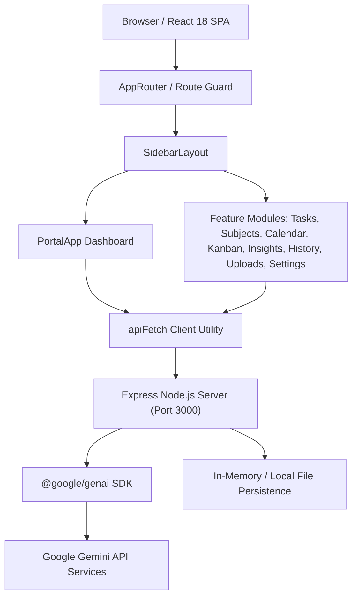

# Architecture Overview

This document describes the high-level architecture, design patterns, and module interactions of the Student Syllabus & Target Study Portal.

---

## High-Level Architecture Diagram

---

## Architectural Layers

The application is structured into four primary layers:

### 1. Presentation & Views (`src/features/*`, `src/components/*`)
- **Feature-Driven Architecture**: Each distinct functional area (e.g., `tasks`, `subjects`, `calendar`, `kanban`, `history`, `uploads`, `insights`, `chatbot`) is self-contained within `src/features/`.
- **Reusable Primitives**: Common UI elements (`Button`, `Card`, `Badge`, `Modal`, `DataTable`, `Tooltip`) reside in `src/components/ui/`.
- **Theme Layer**: Managed via `ThemeContext` providing system light/dark mode switches.

### 2. State & Hooks Layer (`src/features/*/hooks/`, `src/utils/`)
- Local and session state synchronization managed via custom React hooks (`useTasks`, `useSubjects`, `useUploads`).
- Utility functions in `src/utils/` provide centralized date calculations, streak calculations, task ID formatting, and subject lookup.

### 3. API & Service Integration Layer (`src/services/`)
- Unified `apiFetch` wrapper handles client-to-server HTTP requests.
- Transmits standard headers (including `x-user-id` from centralized `STORAGE_KEYS.USER_ID`).

### 4. Server & Backend Services (`server.ts`, `src/features/chatbot/server/`)
- Node.js Express server running on port `3000`.
- Development mode served dynamically using Vite middleware.
- Production builds bundled into a single CommonJS server (`dist/server.cjs`) via `esbuild`.
- Secure server-side proxy for Gemini AI requests (preventing client-side API key exposure).

---

## Key Design Principles

1. **Single Source of Truth**: Centralized configuration keys in `src/config/app.config.ts` prevent fragmented key strings.
2. **Component Reusability**: Shared components like `ViewTaskDetailsModal` prevent UI duplication across views.
3. **Fail-Safe Parsing**: Use of `safeJsonParse` avoids application runtime crashes on invalid stored data.
4. **Secure Secret Handling**: Gemini API keys are read exclusively on the server (`process.env.GEMINI_API_KEY`).
