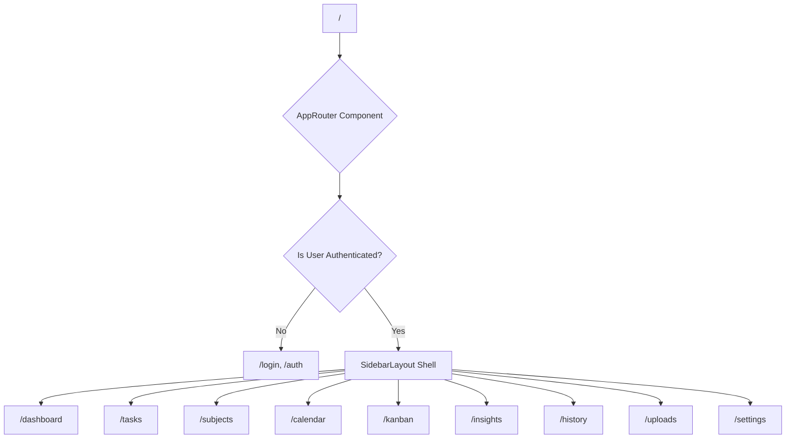

# Routing Architecture & Navigation Flow

This document describes the client-side router, path structure, and navigation layout.

---

## Route Hierarchy Diagram

---

## Route Definitions (`src/routing/route.config.ts`)

| Path | View Component | Description |
| :--- | :--- | :--- |
| `/` or `/dashboard` | `PortalApp` | Main dashboard overview, quick stats, active targets, and streak card |
| `/tasks` | `TaskDatatable` | Multi-view syllabus target manager (List, Grid, Kanban, Timeline) |
| `/subjects` | `SubjectDatatable` | Subject management, progress meters, syllabus topics, resource links |
| `/calendar` | `CalendarView` | Month grid and daily syllabus target schedule |
| `/kanban` | `KanbanBoard` | Column-based drag-and-drop target board |
| `/insights` | `OverviewStats` | Study analytics, completion percentages, time distribution charts |
| `/history` | `HistoryLogs` | Historical audit logs of completed study sessions |
| `/uploads` | `UploadsPage` | Repository for uploaded syllabus PDFs, notes, and target attachments |
| `/settings` | `ProfileSettings` | User profile details and preference toggles |
| `/auth` | `AuthPage` | Login and account registration screen |

---

## Navigation Shell (`src/layouts/SidebarLayout.tsx`)

- Provides collapsible sidebar navigation with active path highlighting.
- Houses header controls including theme toggle button, active study streak counter pill, user profile avatar, and mobile drawer toggles.
