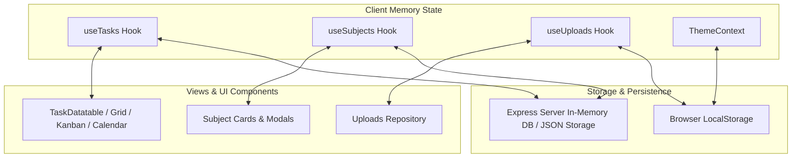

# State Management Architecture

This document describes how data state flows, persists, and synchronizes across components.

---

## State Architecture Diagram

---

## State Layers

### 1. Custom Feature Hooks (`src/features/*/hooks/`)
- `useTasks`: Manages tasks state, filtering by subject, status, category, date ranges, and pagination.
- `useSubjects`: Manages subject definitions, progress tracking, syllabus topics, and resource link additions.
- `useUploads`: Manages uploaded syllabus documents and custom attachments.

### 2. Synchronization & Local Persistence (`src/utils/subjectSync.ts`, `src/config/app.config.ts`)
- Local storage operations are bound to immutable keys defined in `STORAGE_KEYS` (`app.config.ts`):
  - `STORAGE_KEYS.USER_ID`: `portal_user_id`
  - `STORAGE_KEYS.CUSTOM_FILES`: `custom_uploads_data`
  - `STORAGE_KEYS.HISTORY_LOGS`: `history_logs`
  - `STORAGE_KEYS.SUBJECTS`: `syllabus_subjects`
  - `STORAGE_KEYS.TASKS`: `syllabus_tasks`
- Safe parsing via `safeJsonParse` guarantees that invalid string values do not corrupt application execution state.

### 3. Server API Fetching (`src/services/apiService.ts`)
- `apiFetch` injects current user authorization header (`x-user-id`) and JSON headers automatically for cross-view state synchronization.
