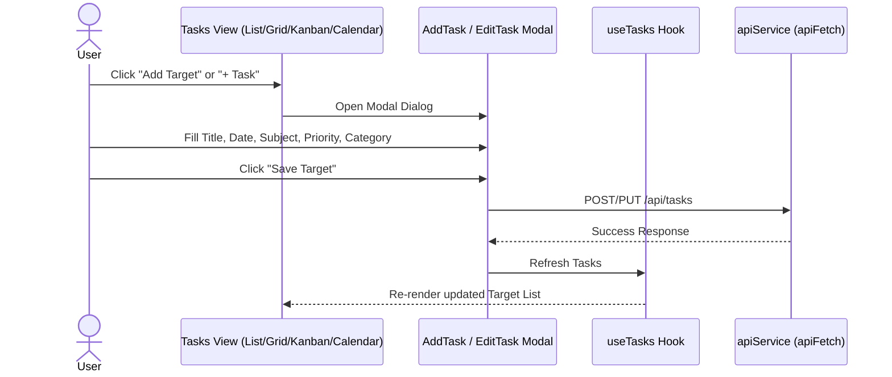
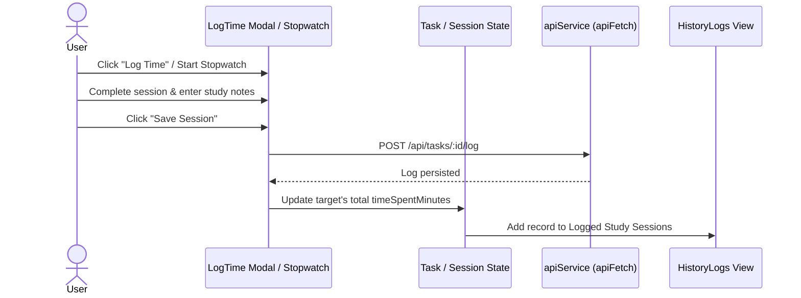
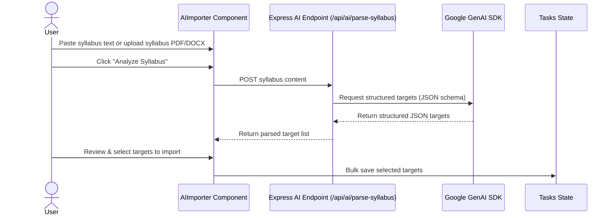
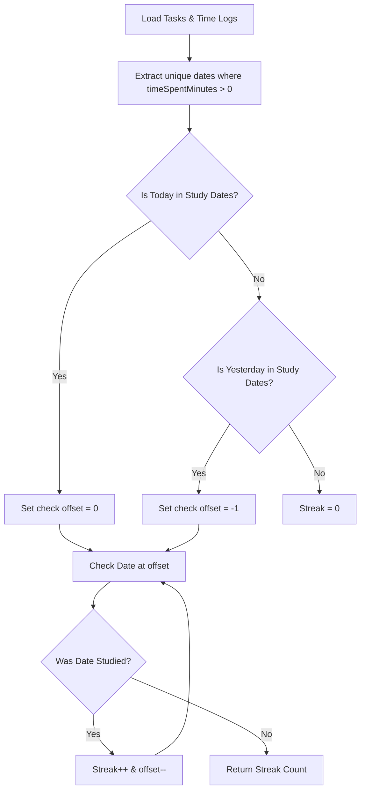

# User Workflows & Component Interactions

This document details the primary workflows supported by the portal, describing entry points, user actions, participating components, and state updates.

---

## 1. Syllabus Target Creation & Management Workflow

### Workflow Details
1. **Entry Point**: Navigation bar "Tasks", Dashboard "Add Target", or Calendar date cell "+".
2. **Components Involved**: `AddTask.tsx`, `EditTask.tsx`, `TaskDatatable.tsx`, `TasksListView.tsx`, `TasksGridView.tsx`, `KanbanBoard.tsx`, `CalendarView.tsx`.
3. **State Updates**: Updates task list state, recalculates upcoming syllabus deadlines, and updates study statistics.

---

## 2. Interactive Study Session Logging Workflow

### Workflow Details
1. **Entry Point**: Stopwatch icon on any target item or Dashboard Active Study widget.
2. **Components Involved**: `LogTime.tsx`, `ViewTaskDetailsModal.tsx`, `HistoryLogs.tsx`, `PortalApp.tsx`.
3. **State Updates**: Increments target's accumulated study minutes, updates user streak count, and creates a history log entry.

---

## 3. AI Syllabus Importer Workflow

### Workflow Details
1. **Entry Point**: Tasks view -> "Import Syllabus via AI".
2. **Components Involved**: `AIImporter.tsx`, `server.ts`, `@google/genai`.
3. **State Updates**: Generates new tasks mapped to subjects automatically.

---

## 4. Daily Study Streak Calculation Flow

---

## 5. File Uploads & Syllabus Attachment Workflow

1. **Entry Point**: Uploads page (`UploadsPage.tsx`) or Task details modal attachments section.
2. **User Actions**: Drag-and-drop or file selector to attach study materials.
3. **Components Involved**: `UploadsPage.tsx`, `ViewTaskDetailsModal.tsx`, `useUploads.ts`.
4. **State Updates**: Saved to `STORAGE_KEYS.CUSTOM_FILES` using `safeJsonParse` and linked to relevant subjects/tasks.
